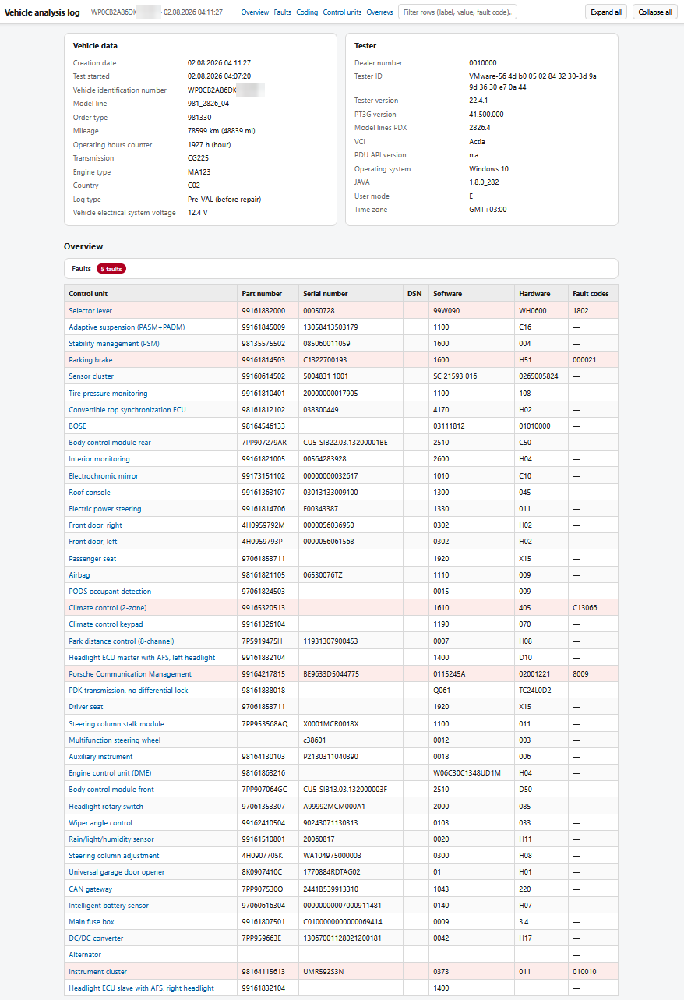

# PIWISViewer



Standalone viewer for Porsche PIWIS 3 "Vehicle Analysis Log" (VAL / FAP)
archives.

Modern browsers refuse to apply the XSLT stylesheets that ship inside the
log zipfiles, so the raw XML is unreadable as delivered. This utility
renders the log to a single self-contained HTML file and opens it in the
default web browser -- with the German labels translated to English.

## Usage

**Easiest:** open the web version at
**<https://ke5fx.github.io/PIWISViewer/>** and drop your log zipfile on
the page. Everything runs client-side in your browser -- nothing is
uploaded, and the VIN and diagnostic data never leave your machine.

Or grab `PIWIS_VAL_Viewer.exe` from the
[Releases](https://github.com/ke5fx/PIWISViewer/releases) page (no
Python required), or run the script directly with Python 3:

```
piwis_val_viewer.py [input.zip|input.xml] [--out FILE] [--no-open]
```

With no arguments, a file dialog asks for the log zipfile (a bare
`FAP_*.xml` also works). The HTML report is written to the system temp
directory (`piwis_val_*.html`) and opened in the browser.

> **Note:** PIWIS may write more than one .zip file for a session.
> When several are present, use the one whose name begins with `FAP_`
> if possible -- that archive contains the vehicle analysis log.

| Option      | Effect                                             |
|-------------|----------------------------------------------------|
| `input`     | skip the file dialog                               |
| `--out`     | write the HTML to a specific path                  |
| `--no-open` | do not launch the browser                          |

The script uses only the Python 3 standard library (tkinter for the
dialog). `PIWIS_VAL_Viewer.bat` is a double-click wrapper that runs it
via `pythonw` so no console window appears.

## Report contents

- Vehicle data / tester data header cards
- **Faults card** (open by default, at the top): only the fault codes,
  descriptions, and extended fault memory of the faulted control units,
  so a fault can be inspected without expanding a unit's full tables.
  The red fault badge on each control unit header jumps here.
- **Overview table**: one row per control unit with part number, serial
  number, DSN, software, hardware, and fault codes (fault rows
  highlighted; hover a fault code for its description)
- **Coding overview**: one collapsible block per control unit
- **One collapsible section per control unit** with identification,
  measured values, coding, and fault memory including the nested
  extended fault memory tables; sections with faults start expanded
- **Filter box** in the top bar: type to show only matching rows across
  all tables (matching sections auto-expand). The **Overrevs** shortcut
  pre-fills the filter with `Nmax` to jump straight to the engine's
  over-rev range records (supported vehicles only).
- Values in `km` or `bar` also show the imperial equivalent:
  `49976 km (31054 mi)`, `2.0 bar (29.0 psi)`

The generated HTML is pure ASCII (non-ASCII characters from the log are
emitted as numeric character references) and fully self-contained.

## German -> English translation

The log's German labels, values, units, and control-unit names are
translated by dictionaries embedded in `piwis_val_viewer.py`. Anywhere a
translation changed the text, the original German is available as a
hover tooltip. Identifiers, abbreviations, and brand names are left
verbatim.

Lookup layers, in order:

| Layer          | Role                                                  |
|----------------|-------------------------------------------------------|
| `TRANS_LABEL`  | whole-label exact matches (e.g. fault descriptions)   |
| `TRANS_SEGMENT`| label segments with digit runs abstracted to `#` ("Histogramm Nr. #" -> "Histogram no. #") |
| `TRANS_PHRASE` | longest-match word/phrase fallback inside segments    |
| compound pass  | unknown words decomposed into known stems ("Heckdeckelkontakt" -> "Rear lid contact", "DrehzahlfuehlerLuftspaltmonitoring" -> "Speed sensor air gap monitoring") |
| `TRANS_VALUE`  | exact matches for value contents ("nein" -> "no")     |
| `TRANS_UNIT`   | unit strings ("Anzahl" -> "count")                    |
| `ECU_GLOSS`    | control-unit names, shown English-first with the German designator on hover |

To extend, add entries to the appropriate dict: keys are plain ASCII
with umlauts transliterated (ae oe ue ss) -- lookup normalizes the log
text the same way, so both spellings found in logs ("Schluessel" and
the umlaut form) hit the same key. Every single-word `TRANS_PHRASE`
entry automatically doubles as a decomposition stem, so each added word
also unlocks the compounds containing it. Full instructions are in the
block comment above the dictionaries.

The dictionaries currently cover a 981 Boxster log (92% of label
occurrences translated; the rest are identifiers) and a 95B Macan log
including its VW/MLB-platform vocabulary. Logs from other models will
likely surface new terms; they pass through untranslated (never
mangled) until entries are added.

## Building the exe

```
pip install pyinstaller
pyinstaller PIWIS_VAL_Viewer.spec
```

produces `dist\PIWIS_VAL_Viewer.exe` (one-file, windowed).

## License

Public domain (see [UNLICENSE](UNLICENSE)).
